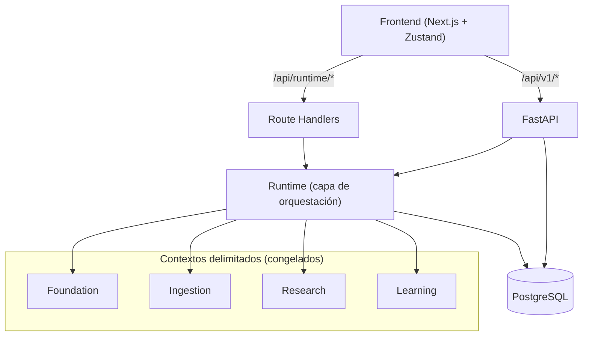
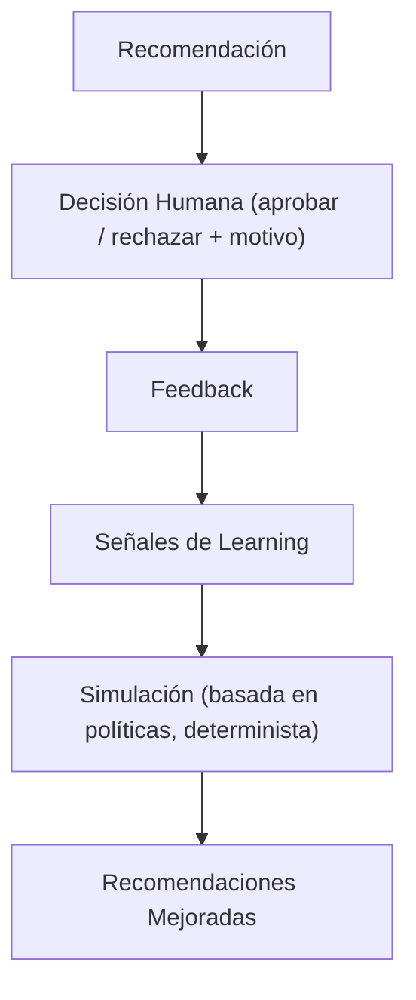
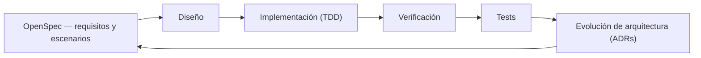

> 🇺🇸 **English version:** [README.md](README.md)

# AI Shorts System

AI Shorts System es una plataforma automatizada de adquisición de conocimiento y producción de contenido. Descubre continuamente noticias de tecnología desde decenas de fuentes externas, jerarquiza lo que importa, canaliza el contenido a través de un flujo de revisión humana, genera guiones y captura cada decisión humana para mejorar sus propias recomendaciones mediante aprendizaje estadístico.

El sistema existe porque producir contenido corto es caro: investigar temas, evaluarlos y escribir guiones consume horas por video. AI Shorts System automatiza la parte de investigación y preparación del pipeline manteniendo a la persona en el bucle para las decisiones editoriales — y el sistema mejora mediblemente con el tiempo a partir de ese feedback.

Por debajo, es un sistema orientado a dominio con arquitectura hexagonal: cuatro contextos delimitados ratificados, una capa delgada de orquestación (runtime) y un frontend Next.js que actúa como centro de operación.

---

## Visión General

Producir videos cortos a escala es caro: investigar temas, evaluarlos, escribir guiones y gestionar el pipeline editorial consume horas por video. AI Shorts System automatiza la parte de investigación y preparación de ese pipeline, manteniendo a la persona en el bucle para las decisiones que importan.

El proyecto comenzó como un monolito y evolucionó a través de ocho epics hasta convertirse en un sistema por capas:

- Una **capa de foundation** que provee mecanismos técnicos (tipos Result, jerarquía de errores, eventos de dominio) con una política de estabilidad inusualmente estricta.
- Cuatro **contextos delimitados** — Foundation, Ingestion, Research y Learning — congelados y gobernados por registros de decisiones de arquitectura (ADRs).
- Una **capa de orquestación (runtime)** que conecta los contextos en pipelines de producción sin modificarlos.
- Un **frontend** (Next.js + Zustand) que opera el sistema: revisión de temas, studio de guiones, scheduler y un dashboard del runtime en vivo.

El sistema está en desarrollo activo. El trabajo más reciente (P0, P1) estabilizó el contrato frontend↔API y entregó el dashboard de operación del runtime.

---

## Por Qué Existe Este Proyecto

Los pipelines de producción de contenido suelen terminar en "generar un guion". Este proyecto existe para construir el bucle completo: adquirir conocimiento, jerarquizarlo, someterlo al juicio humano y usar ese juicio para mejorar lo que se recomienda después. La apuesta es que la calidad editorial viene de un bucle humano–máquina estrecho, no de la automatización sola.

La arquitectura refleja esa apuesta. El sistema mantiene las reglas de negocio en contextos estables y congelados para que el pipeline a su alrededor pueda evolucionar agresivamente; hace que cada decisión humana sea trazable; y demuestra que el aprendizaje funciona con métodos estadísticos y deterministas antes de recurrir al machine learning.

---

## Características Principales

- **Adquisición de contenido desde 16 fuentes reales** — feeds RSS, Reddit y proveedores basados en API (Google News, Hacker News, GitHub Trending, Steam, PlayStation, IGN, GameSpot, Crunchyroll y más).
- **Arquitectura de proveedores declarativa** — agregar una fuente de una tecnología existente es una clase de datos, cero código nuevo.
- **Pipeline de conocimiento** — ingestión, normalización, deduplicación y enrutamiento hacia el flujo de research con integración de aprendizaje orientada a eventos.
- **Feedback humano en el bucle** — una CLI interactiva (Rich) para revisar recomendaciones, aprobar/rechazar con motivos, deshacer y exportar sesiones de decisión.
- **Simulación de aprendizaje adaptativo** — un motor de simulación determinista que modela políticas de feedback humano para proyectar curvas de aprendizaje y crecimiento del dataset.
- **Generación de guiones** — modelos de IA por caso de uso (research, scoring, guion, título, resumen) a través de una única integración con OpenRouter y fallback a mock.
- **Dashboard de operación del runtime** — un frontend que lee el estado en vivo del runtime (fuentes, versión, scheduler, artefactos de learning/feedback) con etiquetado honesto de los datos.
- **~3.700 tests** en 268 archivos de test, impulsados por TDD estricto a través de un flujo de especificación.

---

## Arquitectura

El sistema sigue principios de **Domain-Driven Design** con estructura **hexagonal (puertos y adaptadores)** dentro de cada contexto delimitado y capas de **Clean Architecture** en todo el sistema: `Foundation → Domain → Application → Persistence → Presentation`.

El frontend consume el sistema por dos canales: la API REST heredada (`/api/v1/*`, FastAPI) y los route handlers del runtime (`/api/runtime/*`) que sondean la CLI del runtime del lado del servidor. El runtime orquesta los contextos delimitados, que persisten en PostgreSQL.



**Por qué el Runtime no es un contexto delimitado.** El runtime (`src/runtime/`) no posee dominio de negocio propio. Es una capa delgada de orquestación que conecta los contextos congelados: registra proveedores y fuentes, ejecuta pipelines, agenda jobs y recolecta feedback. Sus decisiones de diseño están documentadas en AD-001 a AD-005 (runtime como orquestación delgada, contextos congelados, sin ML/LLM dentro del runtime — YAGNI). Mantener las reglas de negocio dentro de los contextos y los mecanismos fuera de ellos es lo que permite que los contextos permanezcan congelados mientras el runtime evoluciona.

**Propósito de cada contexto delimitado:**

- **Foundation** — solo mecanismos técnicos (tipos Result, errores, eventos de dominio, puertos); cero reglas de negocio.
- **Ingestion** — posee fuentes de noticias, feeds, artículos crudos, categorías y temas.
- **Research** — posee el ciclo de vida del tema (found → pending review → approved/rejected), el scheduler y el scoring de temas.
- **Learning** — consume eventos de ingestion, construye artefactos y señales de conocimiento, y produce recomendaciones y predicciones.

---

## Principios de Arquitectura

Este proyecto sigue un pequeño conjunto de principios de ingeniería no negociables:

- **La lógica de negocio nunca depende de la infraestructura.** Las capas de dominio importan puertos, nunca adaptadores.
- **El runtime orquesta pero nunca posee reglas de negocio.** Los contextos son el único lugar donde se toman decisiones de dominio.
- **Preferir reutilizar un TechnologyAdapter antes que agregar uno nuevo.** Una fuente nueva debe extender el catálogo, no la capa de transporte.
- **Las decisiones humanas siempre son trazables.** Toda señal de learning se remonta a una decisión registrada.
- **El aprendizaje se mantiene determinista y reproducible.** Las simulaciones usan semilla; los resultados pueden regenerarse.
- **Aprendizaje estadístico antes que machine learning.** Mejorar con estadística explicable primero; sumar ML solo cuando se lo gane.
- **Los contextos congelados no cambian sin revisión arquitectónica.** Se requiere un ADR y un veredicto de la ARB.

---

## Pipeline de Conocimiento

El contenido fluye desde las fuentes externas a través del pipeline hasta las métricas. El paso de simulación reutiliza el mismo pipeline de producción — sin atajos paralelos.

```mermaid
graph LR
    SRC["Fuentes Externas"] --> TA["TechnologyAdapters (RSS / API / Reddit)"]
    TA --> NORM["Normalización"]
    NORM --> DEDUP["Deduplicación"]
    DEDUP --> RES["Research (ciclo de vida del tema y scoring)"]
    RES --> HR["Revisión Humana (frontend + feedback CLI)"]
    HR --> LRN["Learning (señales y recomendaciones)"]
    LRN --> SIM["Simulación (por políticas, determinista)"]
    SIM --> MET["Métricas y Reportes"]
```



---

## Contextos Delimitados

| Contexto | Responsabilidad | Estado | Notas |
|---|---|---|---|
| Foundation | Mecanismos técnicos: `Result[T]`, jerarquía de errores, eventos de dominio, puertos | Completado | **Congelado v1.0** — ratificado por ARB |
| Ingestion | Fuentes de noticias, feeds, artículos crudos, categorías, temas | Completado | Congelado según política de estabilidad |
| Research | Ciclo de vida del tema, scoring, scheduler, registro de fuentes | Completado | Congelado según AD-002 |
| Learning | Artefactos de conocimiento, señales, predicciones, recomendaciones | Completado | **Congelado v1.0** — 1.297 tests |
| Runtime | Orquestación: proveedores, pipelines, jobs, feedback, simulación | Completado (EPIC 8) | **No es un contexto** — capa en evolución |

La política de congelamiento está documentada en `FOUNDATION_STABILITY_POLICY.md`: las adiciones a capas congeladas requieren un ADR, un veredicto de la Architecture Review Board y (para Foundation) los cinco criterios de estabilidad — uso en múltiples contextos, sin reglas de negocio, cero dependencias externas, sin acoplamiento entre contextos y mecanismo-no-política.

---

## Runtime

El runtime (`src/runtime/`) es lo que hace diferente a este sistema: una **capa delgada de orquestación** que conecta los contextos delimitados congelados en pipelines funcionales. Orquesta, coordina y conecta — no contiene reglas de negocio. Las decisiones de dominio viven en los contextos; el runtime cablea proveedores, agenda jobs, enruta eventos y recolecta feedback a su alrededor. Esa separación es lo que permite que el sistema evolucione su maquinaria sin tocar jamás una API congelada.

El runtime es solo CLI y mantiene su estado operativo en memoria.

- **Scheduler** — agendamiento por intervalos basado en APScheduler de jobs registrados (ingestion, learning) con intervalos de polling por fuente.
- **Pipelines** — un orquestador por pasos (ingest → normalize → deduplicate → learning integration) donde los fallos de pasos no fatales acumulan errores pero continúan.
- **Source Registry** — catálogo declarativo de 16 fuentes (12 RSS, 2 Reddit, 2 API).
- **TechnologyAdapters** — un adaptador por mecanismo de acceso: `RSSProvider` (feedparser), `APIProvider` (httpx con paths JSON y transforms opcionales), `RedditProvider`.
- **ProviderAdapters** — entradas `SourceDefinition` que declaran proveedor, tecnología, categorías, prioridad, polling y configuración de retry/rate-limit/auth.
- **EventBridge** — pub/sub liviano que enruta eventos tipados (`pipeline.completed`, `learning.item.ready`, `feedback.recorded`) entre componentes.
- **Feedback** — cola de decisiones en memoria con una CLI interactiva (Rich) (atajos, deshacer, diff de sesión, exportaciones).
- **Simulación** — un motor determinista con reloj virtual que modela la ingesta diaria y las políticas de feedback humano en horizontes configurables.
- **Monitoreo** — métricas de pipeline por proveedor (duración, ítems, errores, reintentos).
- **Trazabilidad** — los registros de feedback y las señales de learning llevan estampas de versión de algoritmo, feature y dataset.

---

## Feedback Humano

El bucle de feedback es lo que hace que el sistema mejore en lugar de solo ejecutarse.



Las decisiones se registran con indicadores de confianza y el razonamiento del propio sistema ("¿por qué esta recomendación?"), para que la persona pueda ver — y corregir — el modelo detrás de la sugerencia. Las sesiones se exportan a JSON con tasas de acuerdo y crecimiento de aprendizaje.

---

## Frontend

El frontend es el **centro de operación** del sistema — una aplicación Next.js 14 (App Router) con gestión de estado en Zustand y un tema inspirado en GlassOS.

- **Runtime Dashboard** (`/runtime`) — seis paneles con el estado en vivo del runtime: fuentes, versión, scheduler, monitoreo, reportes de learning y exportaciones de feedback. Cada dato está etiquetado honestamente (`REAL` / `LEGACY` / `NA`); los datos no disponibles devuelven un estado `unavailable` claro, nunca un mock silencioso.
- **Studio** (`/studio`) — generación de guiones a partir de temas aprobados con tono, duración, nicho y razonamiento.
- **Scheduler** (`/settings`) — start/stop/run-now y configuración del scheduler heredado.
- **Revisión Humana** (`/discover`, `/topics`) — descubrimiento, revisión, aprobar/rechazar y creación manual de temas.
- **Analytics** (`/analytics`) — planificado; actualmente es un placeholder.

El frontend se comunica con el backend mediante un contrato REST (`/api/v1/*`, 18 endpoints) y con el runtime mediante route handlers del lado del servidor que lo sondean por subproceso. Hoy tiene cero tests — agregarlos es un ítem explícito de la hoja de ruta (P3).

---

## Stack Tecnológico

| Categoría | Tecnologías |
|---|---|
| **Backend** | Python 3.12, FastAPI, Uvicorn, Pydantic v2, SQLAlchemy 2.0, APScheduler, httpx, feedparser, Rich |
| **Frontend** | Next.js 14 (App Router), React 18, TypeScript 5.4, Zustand, Tailwind CSS, framer-motion, lucide-react |
| **Base de datos** | PostgreSQL 16 (SQLite retenida para rutas legacy/mock) |
| **Arquitectura** | DDD, Hexagonal (puertos y adaptadores), Clean Architecture, Composition Root, ADRs |
| **IA** | OpenRouter (proveedor multi-modelo único: OpenAI, Anthropic, Google, Mistral) |
| **Testing** | pytest (modo asyncio), TDD estricto vía OpenSpec, markers: unit / integration / performance |
| **Developer Experience** | conventional commits, ruff (ámbito runtime), black, estructura amigable con VS Code |

---

## Estructura del Proyecto

```text
AI_Shorts_System/
├── src/
│   ├── foundation/        # Mecanismos técnicos congelados (Result, errores, eventos, puertos)
│   ├── ingestion/         # Contexto delimitado de ingestion (hexagonal)
│   ├── learning/          # Contexto delimitado de learning (congelado, 1.297 tests)
│   └── runtime/           # Capa de orquestación (proveedores, pipelines, feedback, simulación)
├── domain/                # Capa de dominio heredada (agregados de guion y contenido)
├── application/           # Casos de uso heredados
├── infrastructure/        # Adaptadores heredados (IA, persistencia, repositorios)
├── research/              # Sub-dominio de research (ciclo de vida del tema, scheduler)
├── presentation/          # App FastAPI + composition roots de la CLI
├── services/              # Servicios heredados (IA, TTS, video, publicación)
├── frontend/              # Aplicación Next.js (centro de operación)
├── tests/                 # Suite pytest (unit, integration, performance)
├── scripts/               # Migraciones y herramientas de ejecución
├── docs/                  # Documentación de arquitectura, ADRs, reportes de sprint
├── openspec/              # Artefactos del flujo de especificación
└── sdd/                   # Artefactos de desarrollo guiado por especificación
```

---

## Aspectos Destacados de Ingeniería

- **Domain-Driven Design** — agregados con máquinas de estado explícitas y eventos de dominio, para que las reglas de negocio vivan en un solo lugar y cambien localmente en lugar de filtrarse entre capas.
- **Arquitectura Hexagonal** — puertos definidos en el dominio, adaptadores en infraestructura, para que el almacenamiento, la IA o el HTTP puedan intercambiarse sin tocar la lógica de dominio.
- **Clean Architecture** — capas estrictas `Foundation → Domain → Application → Persistence → Presentation` con capas congeladas, para que la dirección de dependencias sea exigible y no aspiracional.
- **Arquitectura de Proveedores** — diseño de dos capas (adaptadores de tecnología + definiciones declarativas de fuentes) para que decenas de proveedores externos compartan solo tres implementaciones de transporte mientras la normalización específica de cada proveedor queda aislada. Una fuente RSS nueva es una clase de datos, cero código.
- **Registry Pattern** — registries de fuentes, proveedores, pasos y jobs detrás de una única fachada `RegistryManager`, para que extender el sistema nunca signifique editar un switch.
- **Composition Root** — cada ejecutable tiene exactamente un lugar donde se cablean las implementaciones concretas (`presentation/api/container.py`, `src/runtime/composition.py`, `frontend/src/infrastructure/Container.ts`), para que ninguna clase construya sus propias dependencias y los tests puedan sustituir adaptadores libremente.
- **Event Bridge** — pub/sub tipado que desacopla los productores del pipeline de los consumidores de learning, para que ambos lados evolucionen sin un grafo de imports compartido.
- **Aprendizaje con humano en el bucle** — nada se aprende sin una decisión humana; toda señal de learning se remonta a un aprobar/rechazar registrado, porque el scoring automatizado solo no es confiable.
- **Orquestación del runtime** — una capa delgada que evoluciona agresivamente mientras los contextos congelados permanecen estables, porque mejorar el cableado del sistema nunca debe romper sus contratos.
- **Aprendizaje estadístico** — actualizaciones de conocimiento por EMA hacia las tasas de aprobación humanas con decay: mejora determinista y explicable antes de introducir cualquier machine learning.
- **Motor de simulación** — simulación con semilla y reloj virtual que reutiliza el pipeline de producción, para evaluar políticas de feedback contra historias virtuales antes de aplicarlas a decisiones reales.
- **Architecture Decision Records** — los ADRs 021–028 más AD-001..005 del runtime registran *por qué* el sistema es como es, haciendo las decisiones estructurales revisables en lugar de tribales.
- **Suite de tests extensa** — ~3.700 tests, con el mayor peso en los contextos congelados (Learning: 1.297; Runtime: 541), porque las APIs congeladas necesitan prueba, no promesas.

---

## Primeros Pasos

### Requisitos previos

- Python 3.12+
- Node.js 18+ (recomendado 20.x)
- PostgreSQL 16+ corriendo localmente
- API key de OpenRouter (en `.env`)

### Setup del backend

```bash
# Crear y activar el entorno virtual
python -m venv .venv
source .venv/bin/activate

# Instalar dependencias
pip install -r requirements.txt

# Crear la base de datos
createdb -U <usuario> system_shorts

# Configurar el entorno
cp .env.example .env
# Editar .env: OPENROUTER_API_KEY, DATABASE_URL

# Migrar SQLite → PostgreSQL (solo la primera vez)
python scripts/migrate_to_postgres.py

# Ejecutar el servidor de API
python app/main.py api --reload
# → http://localhost:8000  (Swagger UI: /api/docs)
```

### Setup del frontend

```bash
cd frontend
npm install

# Con el backend de API
NEXT_PUBLIC_API_URL=http://localhost:8000 npm run dev
# → http://localhost:3000

# Sin backend (mock en memoria, 8 temas precargados)
npm run dev
```

### CLI del runtime

```bash
# Ciclo completo: ingest → feedback
python run.py

# Comandos individuales
python run.py ingest
python run.py feedback
python run.py schedule --interval 30
python run.py stats
python run.py list-sources

# Simulación (determinista, con semilla)
python run.py simulate --days 30 --iterations 500 --seed 42 --feedback-policy balanced
```

### Tests

```bash
# Default: todo excepto integration (offline)
pytest

# Tests de integración (APIs externas reales)
pytest -m integration

# Ámbito runtime
pytest tests/runtime/
```

---

## Testing

El proyecto sigue un flujo de ingeniería **specification-first**. Los requisitos y escenarios se escriben antes del código, la implementación es test-driven y la verificación cierra el bucle hacia la siguiente iteración de diseño.



- **Organización** — 268 archivos de test que reflejan el árbol fuente bajo `tests/` (runtime, learning, ingestion, foundation, presentation, e2e).
- **Tipos** — tests unit (default), markers `integration` (APIs externas reales) y `performance`.
- **Configuración** — `pytest.ini`: `asyncio_mode = auto`, `pythonpath = src`, default `addopts = -m "not integration"`.
- **Escala** — ~3.700 tests en total; solo el contexto Learning aporta 1.297; el runtime aporta 541 (incluidos 114 tests de simulación).

> **Nota:** algunos tests end-to-end de proveedores usan APIs externas reales y no están marcados como `integration`. En CI, ejecutar `pytest -m "not integration"` con aislamiento de red.

---

## Hoja de Ruta

### Completado

- **EPIC 1–2** — MVP inicial del pipeline; servicio de IA multi-proveedor; fundamentos de clean architecture.
- **EPIC 3–4** — Núcleo del dominio de ingestion y contexto delimitado de ingestion.
- **EPIC 5** — Sprints del contexto de ingestion (unit of work, publicación de eventos).
- **EPIC 6** — Capa de presentación y adaptadores externos; endurecimiento de la API.
- **EPIC 7** — Contexto delimitado de learning (congelado v1.0, 1.297 tests).
- **EPIC 8** — Runtime: adquisición externa, feedback, simulación de aprendizaje adaptativo.
- **Frontend P0–P1** — Estabilización del contrato; dashboard de operación del runtime.

### Planificado

Los epics planificados siguen la evolución natural del sistema — desde operar el pipeline hasta producir y distribuir contenido:

- **EPIC 9 — Deployment e Infraestructura de Producción** — Docker, CI/CD, despliegue en la nube, configuración de entorno y gestión de secretos.
- **EPIC 10 — Observabilidad y Operaciones** — logging, métricas, tracing, monitoreo y alertas.
- **EPIC 11 — Aprendizaje e Inteligencia Avanzados** — evolución del modelo estadístico, mejoras de recomendación y ranking, y el camino de integración para machine learning.
- **EPIC 12 — Producción Automatizada de Contenido** — el pipeline completo de producción de contenido como capacidad de negocio: text-to-speech con selección de voz, generación de subtítulos, composición de video, gestión de assets, sincronización de audio y generación de intro/outro.
- **EPIC 13 — Publicación y Distribución** — publicación en YouTube Shorts, TikTok e Instagram Reels con cola de distribución, agendamiento, políticas de reintento y analíticas.
- **EPIC 14 — Mejora de Contenido con IA** — generación de thumbnails e imágenes, optimización SEO, múltiples variantes de guion, generación de hashtags y generación automática de títulos.

En conjunto, estos epics llevan al sistema por su evolución natural:

`Adquisición de Conocimiento → Revisión Humana → Aprendizaje → Generación de Guiones → Generación de Voz → Composición de Video → Publicación → Mejora Continua`

No se prometen fechas. El foco inmediato es la hoja de ruta del frontend P2–P7 (pasada mobile, baseline de tests, higiene, analytics, gate de decisión de superficie de API, analytics tier-2).

---

## Documentación

- [DOCS.md](DOCS.md) — documentación integral de arquitectura y uso.
- [Documentación de arquitectura](docs/architecture/) — documentos de diseño y ADRs.
- [Política de estabilidad](FOUNDATION_STABILITY_POLICY.md) — política de congelamiento y criterios.
- [OpenSpec](openspec/) — artefactos del flujo de especificación y cambios archivados.
- [Reportes de sprint](docs/sprints/) — documentación de auditorías y sprints.

---

## Contribuciones

Este repositorio sigue:

- **Conventional commits** para todos los cambios.
- **TDD estricto** — especificar escenarios antes de implementar, entregar tests con el código.
- **Disciplina de congelamiento** — las modificaciones a contextos congelados requieren un ADR y un veredicto de la ARB.

Antes de contribuir, leé `FOUNDATION_STABILITY_POLICY.md` y la documentación de arquitectura. Abrí un issue primero para discutir cambios significativos.

---

## Licencia

Licencia por definir.
