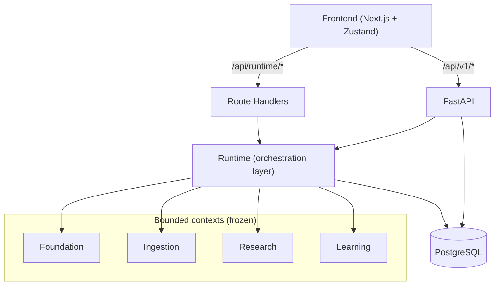
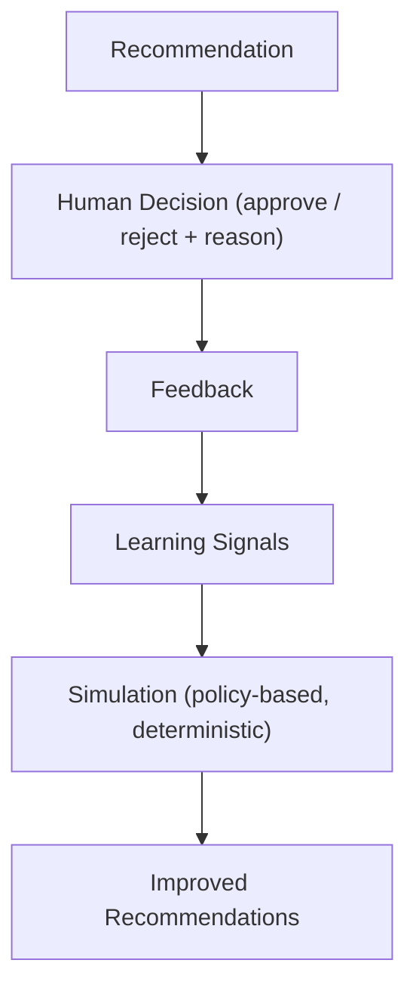
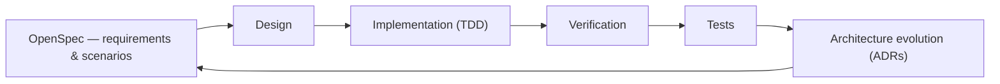

> 🇪🇸 **Spanish version:** [README.es.md](README.es.md)

# AI Shorts System

AI Shorts System is an automated knowledge acquisition and content production platform. It continuously discovers technology news from dozens of external sources, ranks what matters, routes content through a human review workflow, generates scripts, and captures every human decision to improve its own recommendations through statistical learning.

The system exists because short-form content production is expensive: researching topics, evaluating them, and writing scripts consumes hours per video. AI Shorts System automates the research and preparation side of the pipeline while keeping a human in the loop for editorial decisions — and the system gets measurably better over time from that feedback.

Under the hood, it is a domain-driven, hexagonal system: four ratified bounded contexts, a thin runtime orchestration layer, and a Next.js frontend that acts as the operation center.

---

## Overview

Producing short-form video content at scale is expensive: researching topics, evaluating them, writing scripts, and managing the editorial pipeline consumes hours per video. AI Shorts System automates the research and preparation side of that pipeline while keeping a human in the loop for the decisions that matter.

The project started as a monolith and evolved through eight epics into a layered system:

- A **foundation layer** providing technical mechanisms (result types, error hierarchy, domain events) with an unusually strict stability policy.
- Four **bounded contexts** — Foundation, Ingestion, Research, Learning — that are frozen and governed by architecture decision records.
- A **runtime orchestration layer** that connects the contexts into production pipelines without modifying them.
- A **frontend** (Next.js + Zustand) that operates the system: topic review, script studio, scheduler, and a live runtime dashboard.

The system is under active development. The most recent work (P0, P1) stabilized the frontend↔API contract and shipped the runtime operation dashboard.

---

## Why This Project Exists

Content production pipelines usually stop at "generate a script." This project exists to build the whole loop: acquire knowledge, rank it, submit it to human judgment, and use that judgment to improve what gets recommended next. The bet is that editorial quality comes from a tight human–machine loop, not from automation alone.

The architecture reflects that bet. The system keeps business rules in stable, frozen contexts so the pipeline around them can evolve aggressively; it makes every human decision traceable; and it proves that learning works with statistical, deterministic methods before reaching for machine learning.

---

## Key Features

- **Content acquisition from 16 real sources** — RSS feeds, Reddit, and API-based providers (Google News, Hacker News, GitHub Trending, Steam, PlayStation, IGN, GameSpot, Crunchyroll, and more).
- **Declarative provider architecture** — adding a new source of an existing technology is one data class, zero new code.
- **Knowledge pipeline** — ingest, normalize, deduplicate, and route content into the research workflow with event-driven learning integration.
- **Human-in-the-loop feedback** — an interactive CLI (Rich) to review recommendations, approve/reject with reasons, undo, and export decision sessions.
- **Adaptive learning simulation** — a deterministic simulation engine that models human feedback policies to project learning curves and dataset growth.
- **Script generation** — per-use-case AI models (research, scoring, script, title, summary) through a single OpenRouter integration with graceful mock fallback.
- **Runtime operation dashboard** — a frontend that reads live runtime state (sources, version, scheduler, learning/feedback artifacts) with honest data labeling.
- **~3,700 tests** across 268 test files, driven by strict TDD through a specification workflow.

---

## Architecture

The system follows **Domain-Driven Design** principles with a **hexagonal (ports & adapters)** structure inside each bounded context and **Clean Architecture** layering across the system: `Foundation → Domain → Application → Persistence → Presentation`.

The frontend consumes the system through two channels: the legacy REST API (`/api/v1/*`, FastAPI) and runtime route handlers (`/api/runtime/*`) that probe the runtime CLI server-side. The runtime orchestrates the bounded contexts, which persist to PostgreSQL.



**Why the Runtime is not a bounded context.** The runtime (`src/runtime/`) owns no business domain of its own. It is a thin orchestration layer that wires the frozen bounded contexts together: it registers providers and sources, runs pipelines, schedules jobs, and collects feedback. Its design decisions are recorded in AD-001 through AD-005 (e.g., runtime is thin orchestration, bounded contexts are frozen, no ML/LLM inside the runtime — YAGNI). Keeping business rules inside the contexts and mechanics outside them is what allows the contexts to stay frozen while the runtime evolves.

**Bounded context purposes:**

- **Foundation** — technical mechanisms only (result types, errors, domain events, ports); zero business rules.
- **Ingestion** — owns news sources, feeds, raw articles, categories, and topics.
- **Research** — owns the topic lifecycle (found → pending review → approved/rejected), the scheduler, and topic scoring.
- **Learning** — consumes ingestion events, builds knowledge artifacts and signals, and produces recommendations and predictions.

---

## Architectural Principles

This project follows a small set of non-negotiable engineering principles:

- **Business logic never depends on infrastructure.** Domain layers import ports, never adapters.
- **The runtime orchestrates but never owns business rules.** Contexts are the only place where domain decisions are made.
- **Prefer reusing a TechnologyAdapter over adding a new one.** A new source should extend the catalog, not the transport layer.
- **Human decisions are always traceable.** Every learning signal traces back to a recorded decision.
- **Learning stays deterministic and reproducible.** Simulations are seeded; results can be regenerated.
- **Statistical learning before machine learning.** Improve with explainable statistics first; add ML only when it earns its place.
- **Frozen bounded contexts cannot change without architectural review.** An ADR and an ARB verdict are required.

---

## Knowledge Pipeline

Content flows from external sources through the pipeline to metrics. The simulation step reuses the same production pipeline — no parallel shortcuts.

```mermaid
graph LR
    SRC["External Sources"] --> TA["TechnologyAdapters (RSS / API / Reddit)"]
    TA --> NORM["Normalization"]
    NORM --> DEDUP["Deduplication"]
    DEDUP --> RES["Research (topic lifecycle & scoring)"]
    RES --> HR["Human Review (frontend + CLI feedback)"]
    HR --> LRN["Learning (signals & recommendations)"]
    LRN --> SIM["Simulation (policy-driven, deterministic)"]
    SIM --> MET["Metrics & Reports"]
```



---

## Bounded Contexts

| Context | Responsibility | Status | Notes |
|---|---|---|---|
| Foundation | Technical mechanisms: `Result[T]`, error hierarchy, domain events, ports | Completed | **Frozen v1.0** — ARB-ratified |
| Ingestion | News sources, feeds, raw articles, categories, topics | Completed | Frozen per freeze policy |
| Research | Topic lifecycle, scoring, scheduler, source registry | Completed | Frozen per AD-002 |
| Learning | Knowledge artifacts, signals, predictions, recommendations | Completed | **Frozen v1.0** — 1,297 tests |
| Runtime | Orchestration: providers, pipelines, jobs, feedback, simulation | Completed (EPIC 8) | **Not a context** — evolving layer |

The freeze policy is documented in `FOUNDATION_STABILITY_POLICY.md`: additions to frozen layers require an ADR, an Architecture Review Board verdict, and (for Foundation) all five stability criteria — multi-context use, no business rules, zero external dependencies, no context coupling, and mechanism-not-policy.

---

## Runtime

The runtime (`src/runtime/`) is what makes this system different: a **thin orchestration layer** that connects the frozen bounded contexts into working pipelines. It orchestrates, coordinates, and connects — it does not contain business rules. Domain decisions live in the contexts; the runtime wires providers, schedules jobs, routes events, and collects feedback around them. That separation is what lets the system evolve its machinery without ever touching a frozen API.

The runtime is CLI-only and holds its operational state in memory.

- **Scheduler** — APScheduler-based interval scheduling of registered jobs (ingestion, learning) with per-source polling intervals.
- **Pipelines** — a step-based orchestrator (ingest → normalize → deduplicate → learning integration) where non-fatal step failures accumulate errors but continue.
- **Source Registry** — declarative catalog of 16 sources (12 RSS, 2 Reddit, 2 API).
- **TechnologyAdapters** — one adapter per access mechanism: `RSSProvider` (feedparser), `APIProvider` (httpx with JSON paths and optional transforms), `RedditProvider`.
- **ProviderAdapters** — `SourceDefinition` entries that declare provider, technology, categories, priority, polling, retry/rate-limit/auth configuration.
- **EventBridge** — lightweight pub/sub that routes typed events (`pipeline.completed`, `learning.item.ready`, `feedback.recorded`) between components.
- **Feedback** — in-memory decision queue with an interactive Rich CLI (shortcuts, undo, session diff, exports).
- **Simulation** — a deterministic virtual-clock engine that models daily ingest and human feedback policies over configurable horizons.
- **Monitoring** — per-provider pipeline metrics (duration, items, errors, retries).
- **Traceability** — feedback records and learning signals are stamped with algorithm, feature, and dataset versions.

---

## Human Feedback

The feedback loop is what makes the system improve instead of just run.



Decisions are recorded with confidence indicators and the system's own reasoning ("why this recommendation?"), so the human can see — and correct — the model behind the suggestion. Sessions export to JSON with agreement rates and learning growth.

---

## Frontend

The frontend is the system's **operation center** — a Next.js 14 (App Router) application with Zustand state management and a GlassOS-inspired theme.

- **Runtime Dashboard** (`/runtime`) — six panels showing live runtime state: sources, version, scheduler, monitoring, learning reports, and feedback exports. Each data point is labeled honestly (`REAL` / `LEGACY` / `NA`); unavailable data returns a clear `unavailable` state, never a silent mock.
- **Studio** (`/studio`) — script generation from approved topics with tone, duration, niche, and reasoning.
- **Scheduler** (`/settings`) — start/stop/run-now and configuration for the legacy scheduler.
- **Human Review** (`/discover`, `/topics`) — discovery, review, approve/reject, and manual topic creation.
- **Analytics** (`/analytics`) — planned; currently a placeholder.

The frontend talks to the backend through a REST contract (`/api/v1/*`, 18 endpoints) and to the runtime through server-side route handlers that probe it via subprocess. It has zero tests today — adding them is an explicit roadmap item (P3).

---

## Technology Stack

| Category | Technologies |
|---|---|
| **Backend** | Python 3.12, FastAPI, Uvicorn, Pydantic v2, SQLAlchemy 2.0, APScheduler, httpx, feedparser, Rich |
| **Frontend** | Next.js 14 (App Router), React 18, TypeScript 5.4, Zustand, Tailwind CSS, framer-motion, lucide-react |
| **Database** | PostgreSQL 16 (SQLite retained for legacy/mock paths) |
| **Architecture** | DDD, Hexagonal (ports & adapters), Clean Architecture, Composition Root, ADRs |
| **AI** | OpenRouter (single multi-model provider: OpenAI, Anthropic, Google, Mistral) |
| **Testing** | pytest (asyncio mode), strict TDD via OpenSpec, markers: unit / integration / performance |
| **Developer Experience** | conventional commits, ruff (runtime scope), black, VS Code-friendly structure |

---

## Project Structure

```text
AI_Shorts_System/
├── src/
│   ├── foundation/        # Frozen technical mechanisms (Result, errors, events, ports)
│   ├── ingestion/         # Ingestion bounded context (hexagonal)
│   ├── learning/          # Learning bounded context (frozen, 1,297 tests)
│   └── runtime/           # Orchestration layer (providers, pipelines, feedback, simulation)
├── domain/                # Legacy domain layer (script, content idea aggregates)
├── application/           # Legacy use cases
├── infrastructure/        # Legacy adapters (AI, persistence, repositories)
├── research/              # Research sub-domain (topic lifecycle, scheduler)
├── presentation/          # FastAPI app + CLI composition roots
├── services/              # Legacy services (AI, TTS, video, publishing)
├── frontend/              # Next.js application (operation center)
├── tests/                 # pytest suite (unit, integration, performance)
├── scripts/               # Migrations and runner tools
├── docs/                  # Architecture docs, ADRs, sprint reports
├── openspec/              # Specification workflow artifacts
└── sdd/                   # Spec-driven development artifacts
```

---

## Engineering Highlights

- **Domain-Driven Design** — aggregates with explicit state machines and domain events, so business rules live in one place and change locally instead of leaking across layers.
- **Hexagonal Architecture** — ports defined in the domain, adapters in infrastructure, so storage, AI, or HTTP can be swapped without touching domain logic.
- **Clean Architecture** — strict layering `Foundation → Domain → Application → Persistence → Presentation` with frozen layers, so dependency direction is enforceable rather than aspirational.
- **Provider Architecture** — two-layer design (technology adapters + declarative source definitions) so dozens of external providers share only three transport implementations while provider-specific normalization stays isolated. A new RSS source is one data class, zero new code.
- **Registry Pattern** — source, provider, step, and job registries behind a single `RegistryManager` facade, so extending the system never means editing a switch statement.
- **Composition Root** — every executable has exactly one place where concretes are wired (`presentation/api/container.py`, `src/runtime/composition.py`, `frontend/src/infrastructure/Container.ts`), so no class constructs its own dependencies and tests can substitute adapters freely.
- **Event Bridge** — typed pub/sub decouples pipeline producers from learning consumers, so both sides evolve without a shared import graph.
- **Human-in-the-loop Learning** — nothing is learned without a human decision; every learning signal traces to a recorded approve/reject, because automated scoring alone is not trusted.
- **Runtime Orchestration** — a thin layer that evolves aggressively while frozen contexts stay stable, because improving the system's wiring should never break its contracts.
- **Statistical Learning** — EMA-based knowledge updates toward human approval rates with decay: deterministic, explainable improvement before any machine learning is introduced.
- **Simulation Engine** — a seeded, virtual-clock simulation that reuses the production pipeline, so feedback policies can be evaluated against virtual histories before they run on real decisions.
- **Architecture Decision Records** — ADRs 021–028 plus runtime AD-001..005 record *why* the system is the way it is, making structural decisions reviewable instead of tribal.
- **Extensive Test Suite** — ~3,700 tests, with the heaviest weight on frozen contexts (Learning: 1,297; Runtime: 541), because frozen APIs need proof, not promises.

---

## Getting Started

### Prerequisites

- Python 3.12+
- Node.js 18+ (recommended 20.x)
- PostgreSQL 16+ running locally
- OpenRouter API key (in `.env`)

### Backend setup

```bash
# Create and activate the virtual environment
python -m venv .venv
source .venv/bin/activate

# Install dependencies
pip install -r requirements.txt

# Create the database
createdb -U <user> system_shorts

# Configure environment
cp .env.example .env
# Edit .env: OPENROUTER_API_KEY, DATABASE_URL

# Migrate SQLite → PostgreSQL (first time only)
python scripts/migrate_to_postgres.py

# Run the API server
python app/main.py api --reload
# → http://localhost:8000  (Swagger UI: /api/docs)
```

### Frontend setup

```bash
cd frontend
npm install

# With the API backend
NEXT_PUBLIC_API_URL=http://localhost:8000 npm run dev
# → http://localhost:3000

# Without a backend (in-memory mock data, 8 seeded topics)
npm run dev
```

### Runtime CLI

```bash
# Full cycle: ingest → feedback
python run.py

# Individual commands
python run.py ingest
python run.py feedback
python run.py schedule --interval 30
python run.py stats
python run.py list-sources

# Simulation (deterministic, seeded)
python run.py simulate --days 30 --iterations 500 --seed 42 --feedback-policy balanced
```

### Tests

```bash
# Default: everything except integration (offline)
pytest

# Integration tests (real external APIs)
pytest -m integration

# Runtime scope
pytest tests/runtime/
```

---

## Testing

The project follows a **specification-first** engineering workflow. Requirements and scenarios are written before code, implementation is test-driven, and verification closes the loop into the next design iteration.



- **Organization** — 268 test files mirroring the source tree under `tests/` (runtime, learning, ingestion, foundation, presentation, e2e).
- **Types** — unit tests (default), `integration` (real external APIs), and `performance` markers.
- **Configuration** — `pytest.ini`: `asyncio_mode = auto`, `pythonpath = src`, default `addopts = -m "not integration"`.
- **Scale** — ~3,700 tests total; the Learning context alone carries 1,297; the runtime carries 541 (including 114 simulation tests).

> **Note:** some provider end-to-end tests hit real external APIs and are not marked `integration`. In CI, run `pytest -m "not integration"` with network isolation.

---

## Roadmap

### Completed

- **EPIC 1–2** — Initial pipeline MVP; multi-provider AI service; clean architecture foundation.
- **EPIC 3–4** — Ingestion domain core and ingestion bounded context.
- **EPIC 5** — Ingestion context sprints (unit of work, event publication).
- **EPIC 6** — Presentation layer & external adapters; API hardening.
- **EPIC 7** — Learning bounded context (frozen v1.0, 1,297 tests).
- **EPIC 8** — Runtime: external acquisition, feedback, adaptive-learning simulation.
- **Frontend P0–P1** — Contract stabilization; runtime operation dashboard.

### Planned

The planned epics follow the natural evolution of the system — from operating the pipeline to producing and distributing content:

- **EPIC 9 — Deployment & Production Infrastructure** — Docker, CI/CD, cloud deployment, environment configuration, and secrets management.
- **EPIC 10 — Observability & Operations** — logging, metrics, tracing, monitoring, and alerts.
- **EPIC 11 — Advanced Learning & Intelligence** — statistical model evolution, recommendation and ranking improvements, and the integration path for machine learning.
- **EPIC 12 — Automated Content Production** — the full content production pipeline as a business capability: text-to-speech with voice selection, subtitle generation, video composition, asset management, audio synchronization, and intro/outro generation.
- **EPIC 13 — Publishing & Distribution** — YouTube Shorts, TikTok, and Instagram Reels publishing with a distribution queue, scheduling, retry policies, and analytics.
- **EPIC 14 — AI Content Enhancement** — thumbnail and image generation, SEO optimization, multiple script variations, hashtag generation, and automatic title generation.

Together, these epics carry the system through its natural evolution:

`Knowledge Acquisition → Human Review → Learning → Script Generation → Voice Generation → Video Composition → Publishing → Continuous Improvement`

No dates are promised. The immediate focus is the frontend roadmap P2–P7 (mobile pass, test baseline, hygiene, analytics, API-surface decision gate, analytics tier-2).

---

## Documentation

- [DOCS.md](DOCS.md) — comprehensive architecture and usage documentation.
- [Architecture docs](docs/architecture/) — design documents and ADRs.
- [Stability policy](FOUNDATION_STABILITY_POLICY.md) — freeze policy and criteria.
- [OpenSpec](openspec/) — specification workflow artifacts and archived changes.
- [Sprint reports](docs/sprints/) — audit and sprint documentation.

---

## Contributing

This repository follows:

- **Conventional commits** for all changes.
- **Strict TDD** — specify scenarios before implementation, ship tests with code.
- **Freeze discipline** — modifications to frozen contexts require an ADR and an ARB verdict.

Before contributing, read `FOUNDATION_STABILITY_POLICY.md` and the architecture docs. Open an issue first to discuss significant changes.

---

## License

License to be defined.
